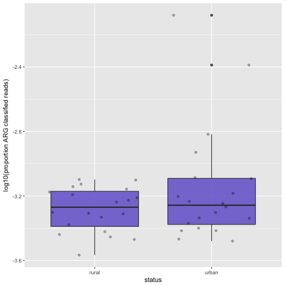
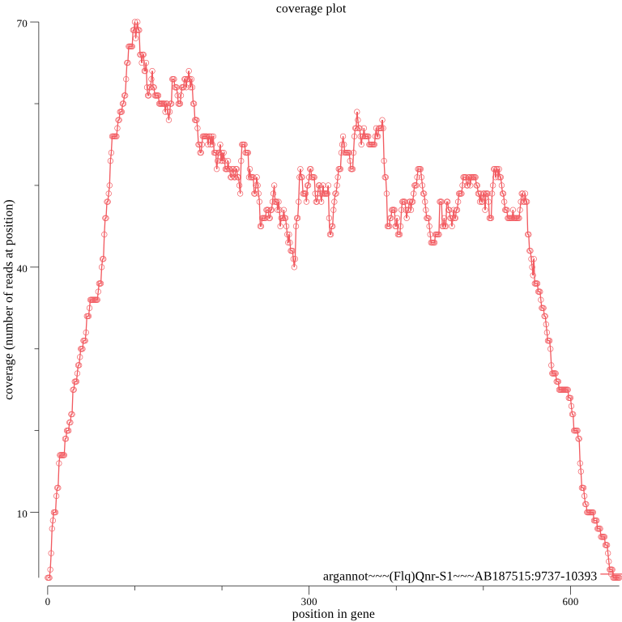

# Tutorial

This tutorial is intended to show you how to use **GROOT** to identify Antimicrobial Resistance Genes (**ARGs**) and generate resistome profiles as part of a metagenome analysis workflow.

---

We will use some metagenome data from a recent paper by [Winglee et al.][1], where they identify differences in the microbiota in rural versus recently urban subjects from the Hunan province of China.

In particular, we will explore this finding:

> "Urban subjects have increased gene diversity, including increased antibiotic resistance"

The aims are:

- download and check the metagenome data (x40 samples)
- classify ARG-derived reads
- generate resistome profiles for each sample
- visualise the data
- look at ARG context

---

## 1. Setup an environment

Use conda to set up an environment with all the software we need for this tutorial:

```
conda create -n grootTutorial -c bioconda parallel sra-tools==2.8 fastqc==0.11.7 bbmap==37.90 multiqc groot==0.8.5 seqkit==0.7.2 samtools==1.4 metacherchant==0.1.0
source activate grootTutorial
```

---

## 2. Get the data

We downloaded `additional file 1, table s1` from the [Winglee paper](https://doi.org/10.1186/s40168-017-0338-7) and saved the SRA accession number and the rural/urban status for each metagenome used in the study.

To begin, save the accession table to file:

<details>
    <summary>samples.txt</summary>
<table>
    <tr><td>SRR4454594</td><td>rural</td></tr>
    <tr><td>SRR4454595</td><td>rural</td></tr>
    <tr><td>SRR4454596</td><td>rural</td></tr>
    <tr><td>SRR4454597</td><td>rural</td></tr>
    <tr><td>SRR4454600</td><td>rural</td></tr>
    <tr><td>SRR4454601</td><td>rural</td></tr>
    <tr><td>SRR4454602</td><td>rural</td></tr>
    <tr><td>SRR4454603</td><td>rural</td></tr>
    <tr><td>SRR4454604</td><td>rural</td></tr>
    <tr><td>SRR4454615</td><td>rural</td></tr>
    <tr><td>SRR4454616</td><td>rural</td></tr>
    <tr><td>SRR4454617</td><td>rural</td></tr>
    <tr><td>SRR4454618</td><td>rural</td></tr>
    <tr><td>SRR4454619</td><td>rural</td></tr>
    <tr><td>SRR4454620</td><td>rural</td></tr>
    <tr><td>SRR4454621</td><td>rural</td></tr>
    <tr><td>SRR4454622</td><td>rural</td></tr>
    <tr><td>SRR4454623</td><td>rural</td></tr>
    <tr><td>SRR4454624</td><td>rural</td></tr>
    <tr><td>SRR4454625</td><td>rural</td></tr>
    <tr><td>SRR4454587</td><td>urban</td></tr>
    <tr><td>SRR4454588</td><td>urban</td></tr>
    <tr><td>SRR4454589</td><td>urban</td></tr>
    <tr><td>SRR4454590</td><td>urban</td></tr>
    <tr><td>SRR4454591</td><td>urban</td></tr>
    <tr><td>SRR4454592</td><td>urban</td></tr>
    <tr><td>SRR4454593</td><td>urban</td></tr>
    <tr><td>SRR4454598</td><td>urban</td></tr>
    <tr><td>SRR4454599</td><td>urban</td></tr>
    <tr><td>SRR4454605</td><td>urban</td></tr>
    <tr><td>SRR4454606</td><td>urban</td></tr>
    <tr><td>SRR4454607</td><td>urban</td></tr>
    <tr><td>SRR4454608</td><td>urban</td></tr>
    <tr><td>SRR4454609</td><td>urban</td></tr>
    <tr><td>SRR4454610</td><td>urban</td></tr>
    <tr><td>SRR4454611</td><td>urban</td></tr>
    <tr><td>SRR4454612</td><td>urban</td></tr>
    <tr><td>SRR4454613</td><td>urban</td></tr>
    <tr><td>SRR4454614</td><td>urban</td></tr>
    <tr><td>SRR4454586</td><td>urban</td></tr>
</table>
</details>
<br/>

Next, use `fastq-dump` to download the sequence data from the accession table:

```
cut -f 1 samples.txt | parallel --gnu "fastq-dump {}"
```

---

## 3. QC

Run [FastQC](https://www.bioinformatics.ba) and check the quality of the data:

```
ls *.fastq | parallel --gnu "fastqc {}"
multiqc .
```

- open up the [MultiQC](multiqc.info/) report in a browser and check the data
- samples should all be clear of adapters
- 3 samples failed on sequence quality

Try cleaning up the 3 failed samples using [BBduk](https://jgi.doe.gov/data-and-tools/bbtools/bb-tools-user-guide/bbmap-guide/):

```bash
ls SRR4454598.fastq SRR4454599.fastq SRR4454610.fastq | parallel --gnu "bbduk.sh in={} out={/.}.trimmed.fastq qtrim=rl trimq=20 minlength=97"
```

- check the data is now passing on sequence quality
- replace the original failed files with the trimmed ones

---

## 4. Run GROOT

Download the pre-clustered [ARG-ANNOT](http://en.mediterranee-infection.com/article.php?laref=283%26titre=arg-annot) database:

```bash
groot get -d arg-annot
```

Index the database:

```bash
groot index -m arg-annot.90 -i groot-index -w 100 -p 8
```

- the metagenomes reads we downloaded earlier are 100 bases long
- we need to set the indexing window size (l) to 100 to match the query read length
- the default MinHash settings should be fine but you can play with them (`groot index --help`)

Align the reads against the index:

```bash
ls *.fastq | parallel --gnu "groot align -i groot-index -f {} -p 8 -g {/.}-groot-graphs > {/.}.bam"
```

- for each sample, the align subcommand produces a BAM file containing all graph traversals for each read
- each BAM file essentially contains the ARG-derived reads in each sample
- the graphs (`.gfa`) which had reads align are stored in a separate directory for each sample (`-g {/.}-groot-graphs`)

### 4.a. Compare ARG diversity

Now that we have classified ARG-derived reads from all of the samples, we can compare the proportion of ARG-derived reads in urban vs. rural samples. We are aiming to replicate the analysis as presented in figure 5d of the [Winglee paper][1]:


Firstly, calculate the proportion of ARG-derived reads in each sample and save to a csv file:

```bash
while read -r line
do
    ID=$(echo $line | cut -f1 -d ' ')
    status=$(echo $line | cut -f2 -d ' ')
    bamFile=${ID}.bam
    mapped=$(samtools view -c -F 4 $bamFile)
    proportion=$(echo "scale=10 ; $mapped / 10000000" | bc)
    printf "$status,$proportion\n" >> proportion-ARG-derived.csv
done < samples.txt
```

Now create a simple box plot using R:

```r
library(ggplot2)

# read in the data and log transform the proportion of ARG classified reads
data <- read.csv(file='proportion-ARG-derived.csv', header=FALSE)
colnames(data) <- c("status", "proportion")
data[2] <- log(data[2], 10)

# plot the data and save to file
png(file = "boxplot.png")
ggplot(data, aes(x=status, y=proportion)) + geom_boxplot(fill="slateblue", alpha=0.8) + geom_point(alpha = 0.3, position = "jitter") + xlab("status") + ylab("log10(proportion ARG classified reads)")
dev.off()
```

This should produce a box plot like this:



We have now compared the proportion of ARG-derived reads from urban and rural samples. This has just used the ARG-derived reads, as was done in the original paper. Although the mean proportion of ARG-derived reads is greater in the urban set, our figure still looks a little different to the published figure. More to come on this...

### 4.b. Generate resistome profiles

The main advantage of GROOT is that it will generate a resistome profile by reporting full-length ARGs. To do this, we need to use the `groot report` command. The report command will output a tab separated file that looks like this:

<table>
    <tr><th>ARG | </th><th>read count | </th><th>gene length | </th><th>coverage |</th></tr>
    <tr><td>argannot~~~(Bla)cfxA4~~~AY769933:1-966</td><td>452</td><td>966</td><td>966M</td></tr>
</table>
<sup>*  the header is not printed in the actual report</sup>

Let's report the resistome profiles for each of our samples:

```bash
ls *.bam | parallel --gnu "groot report --bamFile {} -c 1 --plotCov > {/.}.report"
```

- `-c 1` tells groot to only report ARGs that have been entirely covered by reads, I.E. a full-length,100% identity match
- `--plotCov` tells groot to generate coverage plots for each ARG it reports

We have now generated a resistome profile for each sample, using only full-length ARG sequences (present in the ARG-ANNOT database). We can sum rural/urban resistome profiles with a little bash loop to combine reports:

```bash
while read -r line
do
    ID=$(echo $line | cut -f1 -d ' ')
    status=$(echo $line | cut -f2 -d ' ')
    if [ -s $ID.report ]
        then
            cat $ID.report >> combined-profiles.$status.tsv
    fi
done < samples.txt
wc -l combined-profiles.*
```

The number of ARGs found isn't very large and the difference between rural and urban isn't that big... Let's take a look at the coverage plots in the `./groot-plots` folder. For example:



We can see that the 5' and 3' ends of the genes have low coverage compared to the rest of each gene. The way GROOT works by default is to seed reads covering only the ARGs in the database. So reads that only partially cover a gene (at the 5' and 3' ends) are unlikely to seed. In low coverage samples, which are samples are likely to be, this means that we may not annotate some ARGs using the default settings.

We can try 2 things to report more ARGs:

- set the `--lowCov` flag for groot report -> this will report ARGs with no coverage in the first few bases at the 5' or 3' ends
- re-index the database using a shorter MinHash signature (`-s`) or lower Jaccard similarity threshold (`-j`) -> this will increase the chance of seeding reads that partially cover a gene

Option 2 takes a bit longer as we need to go all the way back in the workflow to indexing, so let's try option 1 for now:

```bash
ls *.bam | parallel --gnu "groot report --bamFile {} --lowCov > {/.}.lowCov.report"
while read -r line
do
    ID=$(echo $line | cut -f1 -d ' ')
    status=$(echo $line | cut -f2 -d ' ')
    if [ -s $ID.lowCov.report ]
        then
            cat $ID.lowCov.report >> combined-profiles.lowCov.$status.tsv
    fi
done < samples.txt
wc -l combined-profiles.lowCov.*
```

We've now ended up with a lot more ARGs being reported thanks to the `--lowCov` option; the downside is that we no longer have 100% length matches and we need to inspect the reports more closely. Here is an example report (SRR4454598):

<table>
    <tr><th>ARG | </th><th>read count | </th><th>gene length | </th><th>coverage |</th></tr>
    <tr><td>argannot~~~(Bla)OXA-347~~~JN086160:1583-2407</td><td>41</td><td>825</td><td>2D822M1D</td></tr>
    <tr><td>argannot~~~(Bla)cfxA5~~~AY769934:28-993</td><td>235</td><td>966</td><td>962M4D</td></tr>
    <tr><td>argannot~~~(MLS)ErmB~~~M11180:714-1451</td><td>245</td><td>738</td><td>2D728M8D</td></tr>
    <tr><td>argannot~~~(Tet)TetQ~~~Z21523:362-2287</td><td>1117</td><td>1974</td><td>3D1971M</td></tr>
</table>

The final column of the GROOT report output is a CIGAR-like representation of the covered bases: M=covered D=absent. The read count and coverage (plus the coverage plots) can help us assess the confidence in the reported genes when we use `--lowCov`. We can also check if reported ARGs share classified reads (i.e. multimappers). To compare reads aligning to 2 ARGs, you could try some commands like this:

```bash
# split the bam by ARG
bamtools split -in out.bam -reference
# extract reads aligning to specific ARGs
bedtools bamtofastq -i ARG1.bam -fq reads-aligned-to-ARG1.fq
bedtools bamtofastq -i ARG27.bam -fq reads-aligned-to-ARG27.fq
# find matching reads
bbduk.sh in=reads-aligned-to-ARG1.fq ref=reads-aligned-to-ARG27.fq outm=matched.fq k=100 mm=f
```

Now let's try plotting the resistome profiles:

More to content to come...

---

## 5. ARG context

Now we have a set of ARGs we know are present in one or more samples, we might want to take a look at what is carrying these genes. We will use [metacherchant](https://www.ncbi.nlm.nih.gov/pubmed/29092015) to determine the genetic context of ARGs using subgraphs. We will also use [Bandage](https://rrwick.github.io/Bandage/) and [Kraken](https://genomebiology.biomedcentral.com/articles/10.1186/gb-2014-15-3-r46) (not installed as part of our conda environment).

Download the full ARG-ANNOT set of genes and then index with samtools:

```bash
wget https://github.com/will-rowe/groot/raw/master/db/full-ARG-databases/arg-annot-db/argannot-args.fna
samtools faidx argannot-args.fna
```

Now we can extract all the genes present in our resistome profiles:

```bash
samtools faidx argannot-args.fna `cut -f1 combined-profiles.urban.tsv` > urban-args.fna
samtools faidx argannot-args.fna `cut -f1 combined-profiles.rural.tsv` > rural-args.fna
```

Remove any duplicate genes:

```bash
cat urban-args.fna | seqkit rmdup -s -o urban-args.fna
cat rural-args.fna | seqkit rmdup -s -o rural-args.fna
```

As a first example, let's look at the genomic context of one ARG (`(Bla)OXA-347`) in urban samples. To begin, get the samples that contain this ARG:

```bash
grep -l "argannot~~~(Bla)OXA-347~~~JN086160:1583-2407" *.lowCov.report | sed 's/.lowCov.report//' > samples-containing-blaOXA-347.list
```

We also need to store the reference sequence:

```bash
samtools faidx argannot-args.fna "argannot~~~(Bla)OXA-347~~~JN086160:1583-2407" > blaOXA-347.fna
```

Now we can run metacherchant:

```bash
while read -r sample
    do
	metacherchant.sh --tool environment-finder \
        -k 31 \
        --coverage=2 \
        --maxradius 1000 \
        --reads ${sample}.fastq \
        --seq blaOXA-347.fna \
        --output "./metacherchant/${sample}/output" \
        --work-dir "./metacherchant/${sample}/workDir" \
	    -p 42 \
	    --trim
    done < samples-containing-blaOXA-347.list
```

To classify the contigs assembled around the detected ARGs, try Kraken:

```bash
while read -r sample
    do
        kraken --threads 8 --preload --fasta-input --db /path/to/minikraken_20141208 metacherchant/${sample}/output/seqs.fasta | kraken-report --db /path/to/minikraken_20141208 > metacherchant/${sample}/${sample}-kraken.report
    done < samples-containing-blaOXA-347.list
```

<sup>\* you will need to install kraken and download minikraken for this</sup>

To visualise the ARG context, first load the assembly graph into Bandage:

```bash
Bandage load metacherchant/SRR4454592/output/graph.gfa
```

Next,

More content to come soon...

[1]: https://doi.org/10.1186/s40168-017-0338-7
